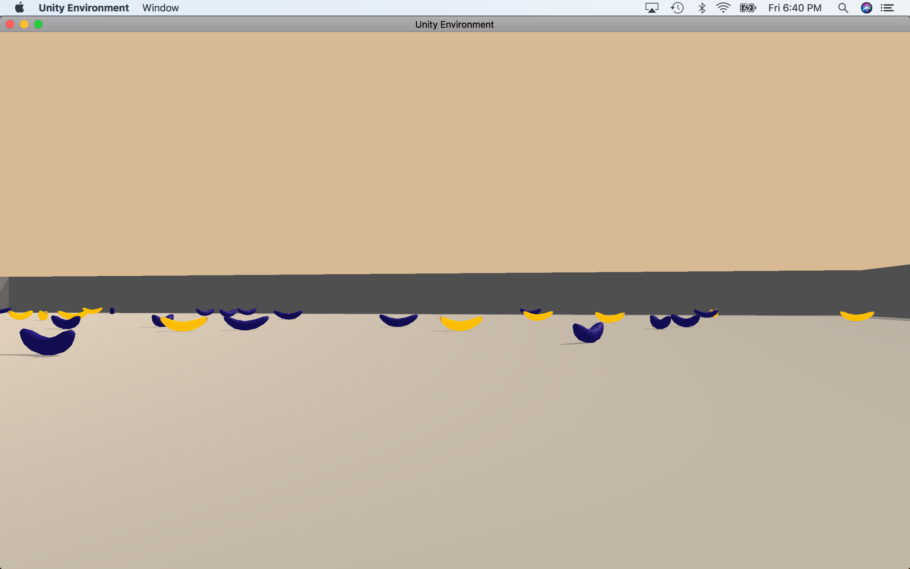
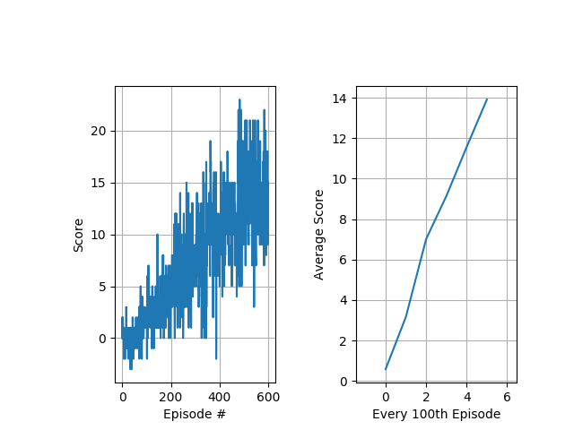

# Project: Navigation
## Saminda Abeyruwan

In this project, we have trained an agent that successfully navigates a square environment and collects _banana_ shaped objects. When the agent collects a yellow object, it gets +1, and when it collects a blue object, it gets -1, otherwise 0. Following image shows an instance of the environment.

The learning agent is designed using the concepts of model-free reinforcement learning (RL). Therefore, at each decision point, based on the state of the environment, the agent takes an action that maximizes to the objective of collecting more +1 objects (rewards). The agent has four actions - move forward, move backward, turn left, and turn right. The environment state is available as a 37 feature vector, which includes the velocity of the agent, distance to other object in the environment among others. 

The final performance criteria of the agent is to select objects such that the agent must maintain a score of +13 points over 100 consecutive episodes.

### Learning Algorithm

I have used [Deep Double Q-learning](https://arxiv.org/pdf/1509.06461.pdf) algorithm (DDQN) as the basis to develop the learning agent. It has been shown that DDQN not only reduces the observed overestimation, but also leads to better performance. My implementation for learning, testing, and debugging is available in [ddqn.py](ddqn.py).

### State Representation

The agent receives a real feature vector containing 37 elements (size is (37,)). In order to capture the temporal aspects, I have also included _num\_history_ of past features to create the input state representation of size _(num\_history, 37)_. I have used this design, as we explore the architecture of the deep neural network (DNN), we can directly use nn.Conv1d, and nn.BatchNorm1d to develop a DNN with better modeling power and capacity. 

The very first state is repeated _num\_history_ times to a Python deque. All the next states are appended to the deque and generated the state vector. The implementation is available [here](ddqn.py#L124). 

### Deep Q-Network

I have committed to the following DQN architecture (created with [pytorch-summary](https://github.com/sksq96/pytorch-summary)). The implementation is available [here](ddqn.py#L142).

	----------------------------------------------------------------
	        Layer (type)               Output Shape         Param #
	================================================================
	            Conv1d-1               [-1, 16, 17]             336
	       BatchNorm1d-2               [-1, 16, 17]              32
	            Conv1d-3                [-1, 16, 7]           1,296
	       BatchNorm1d-4                [-1, 16, 7]              32
	            Conv1d-5                [-1, 16, 2]           1,296
	       BatchNorm1d-6                [-1, 16, 2]              32
	            Linear-7                   [-1, 32]           1,056
	            Linear-8                   [-1, 32]           1,056
	            Linear-9                    [-1, 4]             132
	================================================================
	Total params: 5,268
	Trainable params: 5,268
	Non-trainable params: 0
	----------------------------------------------------------------
	Input size (MB): 0.00
	Forward/backward pass size (MB): 0.01
	Params size (MB): 0.02
	Estimated Total Size (MB): 0.03
	----------------------------------------------------------------
  
### Training Setup

The training has been done on the GCP. I have used some credits available for me from Computer Vision Nanodegree to setup a CUDA based GCP instance, and trained the agent. The instance has been initiated with:

	gcloud compute instances create $INSTANCE_NAME \
	        --zone=$ZONE \
	        --image=$IMAGE \
	        --project=$PROJECT_NAME \
	        --image-project=deeplearning-platform-release \
	        --maintenance-policy=TERMINATE \
	        --accelerator='type=nvidia-tesla-k80,count=1' \
	        --metadata='install-nvidia-driver=True' \
	        --machine-type=n1-standard-2

 I have copied the __/data/Banana\_Linux\_NoVis__ simulator from Udacity Workspace to the cloud instance, and used the __Banana.x86\_64__ binary in _UnityEnvironment_. It works!
 
### Learning

There are many knobs to tune in the algorithm. The parameters that worked best for me are:

| Parameter     | Value         | 
| ------------- |:-------------:| 
| learning rate |  0.001        |
| replay_memory |  10000        |
| num_history   |     4         |
| num_episodes  |    600        |
| batch_size    |    64         |
| update_every  |    4          |
| gamma         |   0.99        |
| tau           |  0.001        |
| epsilon_start |   1.0         |
| epsilon_end   |     0.01      |
| epsilon_decay |   0.995       |

I have used [Adam](https://arxiv.org/abs/1412.6980) optimizer and [smooth L1 loss](https://en.wikipedia.org/wiki/Huber_loss) as the cost function. During training, the algorithm uses epsilon-greedy action selection policy, which has started at epsilon\_start and annealed to epsilon\_end with a decay eps * epsilon\_decay. eps is the epsilon value at the start of an episode.   

The agent solved the problem within __600 episodes__, and the weights are saved in [checkpoint_solved.pth](checkpoint_solved.pth). The following figure shows the performance during learning.

Following is the learning trace.

	jupyter@my-compute-engine-instance:~/deep-reinforcement-learning/p1_navigation$ python3 ddqn.py --unity_file_name=/home/jupyter/Banana_Linux_NoVis/Banana.x86_64 --num_episodes=1200 --gamma=0.99 --num_episodes=600
	INFO:ddqn:use_cuda:       cuda
	INFO:ddqn:input_width:    37
	INFO:ddqn:num_actions:    4
	INFO:ddqn:unity_file_name:/home/jupyter/Banana_Linux_NoVis/Banana.x86_64
	INFO:ddqn:learning rate:  0.001
	INFO:ddqn:replay_memory:  10000
	INFO:ddqn:num_history:    4
	INFO:ddqn:num_episodes:   600
	INFO:ddqn:batch_size:     64
	INFO:ddqn:update_every:   4
	INFO:ddqn:gamma:          0.99
	INFO:ddqn:tau:            0.001
	INFO:ddqn:epsilon_start:  1.0
	INFO:ddqn:epsilon_end:    0.01
	INFO:ddqn:epsilon_decay:  0.995
	INFO:ddqn:allow_random:   1
	INFO:ddqn:debug_mode:     0
	Found path: /home/jupyter/Banana_Linux_NoVis/Banana.x86_64
	Mono path[0] = '/home/jupyter/Banana_Linux_NoVis/Banana_Data/Managed'
	Mono config path = '/home/jupyter/Banana_Linux_NoVis/Banana_Data/MonoBleedingEdge/etc'
	Preloaded 'libgrpc_csharp_ext.x64.so'
	Unable to preload the following plugins:
	        libgrpc_csharp_ext.x86.so
	Logging to /home/jupyter/.config/unity3d/Unity Technologies/Unity Environment/Player.log
	INFO:unityagents:
	'Academy' started successfully!
	Unity Academy name: Academy
	        Number of Brains: 1
	        Number of External Brains : 1
	        Lesson number : 0
	        Reset Parameters :
	
	Unity brain name: BananaBrain
	        Number of Visual Observations (per agent): 0
	        Vector Observation space type: continuous
	        Vector Observation space size (per agent): 37
	        Number of stacked Vector Observation: 1
	        Vector Action space type: discrete
	        Vector Action space size (per agent): 4
	        Vector Action descriptions: , , ,
	Number of agents: 1
	Number of actions: 4
	INFO:root:DQN::__init__()
	INFO:root:DQN::__init__()
	Episode 100     Average Score: 0.582    Eps: 0.606
	Episode 200     Average Score: 3.16     Eps: 0.367
	Episode 300     Average Score: 7.01     Eps: 0.222
	Episode 400     Average Score: 9.14     Eps: 0.135
	Episode 500     Average Score: 11.56    Eps: 0.082
	Episode 539     Average Score: 13.01    Eps: 0.067
	Environment solved in 439 episodes!     Average Score: 13.01
	Episode 540     Average Score: 13.05    Eps: 0.067
	Environment solved in 440 episodes!     Average Score: 13.05
	Episode 541     Average Score: 13.11    Eps: 0.066
	Environment solved in 441 episodes!     Average Score: 13.11
	Episode 542     Average Score: 13.04    Eps: 0.066
	Environment solved in 442 episodes!     Average Score: 13.04
	Episode 544     Average Score: 13.05    Eps: 0.065
	Environment solved in 444 episodes!     Average Score: 13.05
	Episode 545     Average Score: 13.04    Eps: 0.065
	Environment solved in 445 episodes!     Average Score: 13.04
	Episode 546     Average Score: 13.12    Eps: 0.065
	Environment solved in 446 episodes!     Average Score: 13.12
	Episode 547     Average Score: 13.18    Eps: 0.064
	Environment solved in 447 episodes!     Average Score: 13.18
	Episode 548     Average Score: 13.15    Eps: 0.064
	Environment solved in 448 episodes!     Average Score: 13.15
	Episode 549     Average Score: 13.12    Eps: 0.064
	Environment solved in 449 episodes!     Average Score: 13.12
	Episode 550     Average Score: 13.06    Eps: 0.063
	Environment solved in 450 episodes!     Average Score: 13.06
	Episode 551     Average Score: 13.17    Eps: 0.063
	Environment solved in 451 episodes!     Average Score: 13.17
	Episode 552     Average Score: 13.19    Eps: 0.063
	Environment solved in 452 episodes!     Average Score: 13.19
	Episode 553     Average Score: 13.19    Eps: 0.063
	Environment solved in 453 episodes!     Average Score: 13.19
	Episode 554     Average Score: 13.18    Eps: 0.062
	Environment solved in 454 episodes!     Average Score: 13.18
	Episode 555     Average Score: 13.18    Eps: 0.062
	Environment solved in 455 episodes!     Average Score: 13.18
	Episode 556     Average Score: 13.24    Eps: 0.062
	Environment solved in 456 episodes!     Average Score: 13.24
	Episode 557     Average Score: 13.25    Eps: 0.061
	Environment solved in 457 episodes!     Average Score: 13.25
	Episode 558     Average Score: 13.33    Eps: 0.061
	Environment solved in 458 episodes!     Average Score: 13.33
	Episode 559     Average Score: 13.33    Eps: 0.061
	Environment solved in 459 episodes!     Average Score: 13.33
	Episode 560     Average Score: 13.35    Eps: 0.060
	Environment solved in 460 episodes!     Average Score: 13.35
	Episode 561     Average Score: 13.38    Eps: 0.060
	Environment solved in 461 episodes!     Average Score: 13.38
	Episode 562     Average Score: 13.41    Eps: 0.060
	Environment solved in 462 episodes!     Average Score: 13.41
	Episode 563     Average Score: 13.48    Eps: 0.059
	Environment solved in 463 episodes!     Average Score: 13.48
	Episode 564     Average Score: 13.48    Eps: 0.059
	Environment solved in 464 episodes!     Average Score: 13.48
	Episode 565     Average Score: 13.50    Eps: 0.059
	Environment solved in 465 episodes!     Average Score: 13.50
	Episode 566     Average Score: 13.48    Eps: 0.059
	Environment solved in 466 episodes!     Average Score: 13.48
	Episode 567     Average Score: 13.56    Eps: 0.058
	Environment solved in 467 episodes!     Average Score: 13.56
	Episode 568     Average Score: 13.53    Eps: 0.058
	Environment solved in 468 episodes!     Average Score: 13.53
	Episode 569     Average Score: 13.54    Eps: 0.058
	Environment solved in 469 episodes!     Average Score: 13.54
	Episode 570     Average Score: 13.55    Eps: 0.057
	Environment solved in 470 episodes!     Average Score: 13.55
	Episode 571     Average Score: 13.65    Eps: 0.057
	Environment solved in 471 episodes!     Average Score: 13.65
	Episode 572     Average Score: 13.67    Eps: 0.057
	Environment solved in 472 episodes!     Average Score: 13.67
	Episode 573     Average Score: 13.74    Eps: 0.057
	Environment solved in 473 episodes!     Average Score: 13.74
	Episode 574     Average Score: 13.77    Eps: 0.056
	Environment solved in 474 episodes!     Average Score: 13.77
	Episode 575     Average Score: 13.80    Eps: 0.056
	Environment solved in 475 episodes!     Average Score: 13.80
	Episode 576     Average Score: 13.70    Eps: 0.056
	Environment solved in 476 episodes!     Average Score: 13.70
	Episode 577     Average Score: 13.70    Eps: 0.055
	Environment solved in 477 episodes!     Average Score: 13.70
	Episode 578     Average Score: 13.61    Eps: 0.055
	Environment solved in 478 episodes!     Average Score: 13.61
	Episode 579     Average Score: 13.66    Eps: 0.055
	Environment solved in 479 episodes!     Average Score: 13.66
	Episode 580     Average Score: 13.70    Eps: 0.055
	Environment solved in 480 episodes!     Average Score: 13.70
	Episode 581     Average Score: 13.83    Eps: 0.054
	Environment solved in 481 episodes!     Average Score: 13.83
	Episode 582     Average Score: 13.82    Eps: 0.054
	Environment solved in 482 episodes!     Average Score: 13.82
	Episode 583     Average Score: 13.66    Eps: 0.054
	Environment solved in 483 episodes!     Average Score: 13.66
	Episode 584     Average Score: 13.77    Eps: 0.054
	Environment solved in 484 episodes!     Average Score: 13.77
	Episode 585     Average Score: 13.76    Eps: 0.053
	Environment solved in 485 episodes!     Average Score: 13.76
	Episode 586     Average Score: 13.80    Eps: 0.053
	Environment solved in 486 episodes!     Average Score: 13.80
	Episode 587     Average Score: 13.87    Eps: 0.053
	Environment solved in 487 episodes!     Average Score: 13.87
	Episode 588     Average Score: 13.79    Eps: 0.052
	Environment solved in 488 episodes!     Average Score: 13.79
	Episode 589     Average Score: 13.93    Eps: 0.052
	Environment solved in 489 episodes!     Average Score: 13.93
	Episode 590     Average Score: 13.93    Eps: 0.052
	Environment solved in 490 episodes!     Average Score: 13.93
	Episode 591     Average Score: 13.98    Eps: 0.052
	Environment solved in 491 episodes!     Average Score: 13.98
	Episode 592     Average Score: 13.94    Eps: 0.051
	Environment solved in 492 episodes!     Average Score: 13.94
	Episode 593     Average Score: 14.00    Eps: 0.051
	Environment solved in 493 episodes!     Average Score: 14.00
	Episode 594     Average Score: 13.93    Eps: 0.051
	Environment solved in 494 episodes!     Average Score: 13.93
	Episode 595     Average Score: 13.98    Eps: 0.051
	Environment solved in 495 episodes!     Average Score: 13.98
	Episode 596     Average Score: 13.94    Eps: 0.050
	Environment solved in 496 episodes!     Average Score: 13.94
	Episode 597     Average Score: 13.94    Eps: 0.050
	Environment solved in 497 episodes!     Average Score: 13.94
	Episode 598     Average Score: 13.84    Eps: 0.050
	Environment solved in 498 episodes!     Average Score: 13.84
	Episode 599     Average Score: 13.88    Eps: 0.050
	Environment solved in 499 episodes!     Average Score: 13.88
	Episode 600     Average Score: 13.91    Eps: 0.049
	
	Environment solved in 500 episodes!     Average Score: 13.91

### Testing

The trained agent achieves +15 on the test environment. To run on the test environment:

	python3 ddqn.py --unity_file_name=path/to/Banana.app --training_mode=0
	
The following video shows that the learned agent navigates the environment and collects +15 points. That is pretty awesome and cool!

### Ideas for Future Work

TODO(saminda)

	
     
